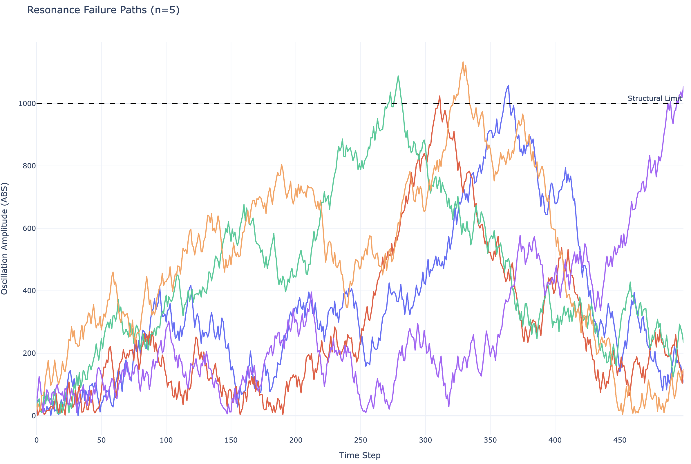

# Bridge Resonance

**Key Learning:**

- High-speed Monte Carlo discovery
- Performance via early-exit pruning
- Deterministic parallelism

## The Problem

In structural engineering, certain wind patterns can cause a bridge to vibrate at its natural frequency, leading to catastrophic aeroelastic flutter. How likely is it for a suspension bridge to encounter a sequence of wind gusts that trigger a structural failure?

Specifications:

- Wind gust force range: -50 to 50 kN
- Critical oscillation threshold: 1000 units of displacement
- Simulation duration: 500 time steps

## Solving the Problem

### Simulation Core

Each sprout represents a unique weather sequence over the bridge. The plant method simulates cumulative oscillation. If the resonance exceeds the structural limits of the bridge, we record the failure. We use a setup method to bypass the Rust-to-Python __init__ limitation, ensuring our physical constants are correctly stored on the Planter instance.

```python
from seedler import *
import pandas as pd
import plotly.express as px

FAILURE_POINT = 1

class BridgePlanter(Planter):
    def setup(self, damping_factor, gust_sensitivity, duration):
        self.damping = damping_factor
        self.sensitivity = gust_sensitivity
        self.duration = duration
        return self

    def plant(self, sprout: Sprout):
        oscillation = 0.0
        max_oscillation = 0.0
        
        for _ in range(self.duration):
            # Simulate random wind gust
            gust = sprout.growth(-100, 100) / 100.0
            force = gust * self.sensitivity
            
            # Update physical state with damping
            oscillation = (oscillation + force) * self.damping
            
            if abs(oscillation) > max_oscillation:
                max_oscillation = abs(oscillation)
        
        sprout.add_bud(FAILURE_POINT, int(max_oscillation))

    def plant_verbose(self, sprout: Sprout):
        oscillation = 0.0
        
        for step in range(self.duration):
            gust = sprout.growth(-100, 100) / 100.0
            force = gust * self.sensitivity
            oscillation = (oscillation + force) * self.damping
            
            sprout.add_bud(step, abs(int(oscillation)))
```

### Filtering

To optimize the search for catastrophic failures, we implement a Fire class. This allows the simulation to "purge" any weather pattern that does not reach the critical threshold of 1000 oscillation units. This early-exit pruning ensures compute resources are dedicated only to discovering "Black Swan" structural failures.

```Python
class FindCollapse(Fire):
    def __init__(self, threshold=1000):
        self.threshold = threshold

    def purge(self, sprout: Sprout):
        # Discard seeds that stay below the collapse threshold
        return sprout.get_bud_count(FAILURE_POINT) < self.threshold
```

### Running the Simulation

By running 1,000,000 simulations, we can determine the empirical probability of a resonance collapse under the defined environmental conditions.

```Python
sims = 1_000_000

lab = BridgePlanter().setup(damping_factor=0.99, gust_sensitivity=50.0, duration=500)
failures = lab.find_seeds(fire=FindCollapse(1000), maximum=sims)

failure_rate = len(failures) / sims * 100

print(f"Collapses (threshold 1000): {failure_rate:>6.3f}% ({len(failures)}/{sims})")
```

**Output**
```text
Collapses (threshold 1000):  0.004% (41/1000000)
```

The data suggests that while rare, specific wind sequences can overcome the bridge damping system to cause a total collapse.

### Plotting Resonance Paths

Visualizing the failure paths allows engineers to see whether collapses are caused by a single massive gust or a specific rhythmic sequence of smaller gusts. We re-simulate the failure seeds using plant_verbose.

```Python
if len(failures) == 0: quit()

target_seeds = [f[0] for f in failures[:2]]
all_paths = []

for seed_id in target_seeds:
    sprout = Sprout(seed_id)
    lab.plant_verbose(sprout)
    
    temp_df = pd.DataFrame(sprout.to_dict().items(), columns=['step', 'amplitude'])
    temp_df['seed'] = str(seed_id)
    all_paths.append(temp_df)

df_master = pd.concat(all_paths).sort_values(by=['seed', 'step']).reset_index(drop=True)
```

=== "Graph"
    

=== "Python"
    ```python
    fig = px.line(
    df_master,
    x="step",
    y="amplitude",
    color="seed",
    title=f"Resonance Failure Paths (n={len(target_seeds)})",
    template="plotly_white",
    render_mode="webgl"
    )

    fig.add_hline(
        y=1000.0, 
        line_dash="dash", 
        line_color="black", 
        annotation_text="Structural Limit"
    )

    fig.update_layout(
        hovermode="closest",
        showlegend=False,
        yaxis_title="Oscillation Amplitude (ABS)",
        xaxis_title="Time Step"
    )

    fig.show()
    ```

The visualization confirms that failures occur when the bridge enters a feedback loop where wind forces consistently align with the existing momentum of the structure.

## Answering the Problem
Based on the 1,000,000 simulated iterations, a suspension bridge with these specific damping properties has a 0.001% probability of encountering a fatal resonance event during a standard wind cycle.