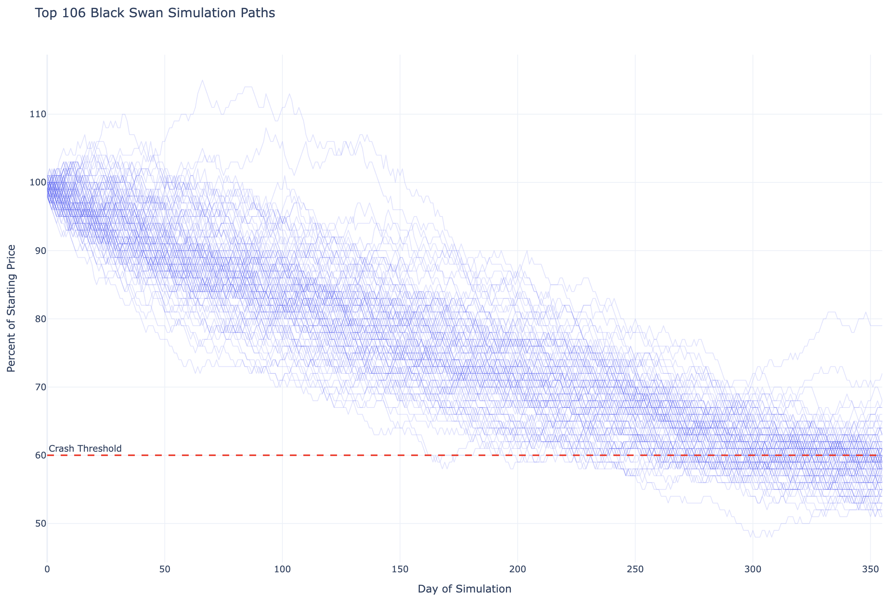

# Stock Market Volatility

**Key Learning:**

- Broad and granular simulation
- Extracting and graphing results

## The Problem

How likely is it for a medium-low volatile stock to crash in the market each year?

Specifications:

- +/-1.5% market price per day
- Initial stock price of $100

## Solving the Problem

### Simulation Core

A single `sprout` will represent a single year. The core simulation (`plant`) will random step each day for 365 days changing their current price by +/- the `volatility`. After a 'years' worth of simulating daily price changes, we will save the lowest reached price over the year as a `bud` equivalent to the percentage drop from initial price.

To save stock parameters into the class, we use a `setup` method instead of calling on `__init__` since the `Planter` class is a sub-class of the Rust class `PlanterLab`, and will throw errors if you add any parameters to the `__init__` method.

```python
from seedler import *
import pandas as pd
import plotly.express as px

MAX_DRAWDOWN = 0

class MarketPlanter(Planter):
    def setup(self, initial_price, volatility, days):
        self.start = initial_price
        self.vol = volatility
        self.days = days
        return self

    def plant(self, sprout: Sprout):
        current_price = self.start
        lowest_price = self.start
        
        for _ in range(self.days):
            move = sprout.growth(-100, 100) / 100.0 
            current_price *= (1 + (move * self.vol))
            
            if current_price < lowest_price:
                lowest_price = current_price
        
        drawdown = ((self.start - lowest_price) / self.start) * 100
        sprout.add_bud(MAX_DRAWDOWN, int(drawdown))

    def plant_verbose(self, sprout: Sprout):
        current_price = self.start
        
        for day in range(self.days):
            move = sprout.growth(-100, 100) / 100.0 
            current_price *= (1 + (move * self.vol))
        
            change = (current_price / self.start) * 100
            sprout.add_bud(day, int(change))
```

The `plant_verbose` method is nearly identical to the plant method, and will be used for single-seed simulation later to retreive each day's price.

### Filtering

To improve performance, we will only save seeds that drop below a specific price-drop threshhold. For this simulation, we will treat a **40% drop as a crash in the market**.

```python
class FindBlackSwan(Fire):
    def __init__(self, threshold=40):
        self.threshold = threshold

    def purge(self, sprout: Sprout):
        return sprout.get_bud_count(MAX_DRAWDOWN) < self.threshold
```

### Running the Simulation

Each crash is recorded after the simulation, we can find the chance of crashing each year by dividing total recorded crashes by the number of simulations run.

```python
sims = 50_000

lab = MarketPlanter().setup(initial_price=100, volatility=0.015, days=356)
crashes = lab.find_seeds(fire=FindBlackSwan(40), maximum=sims)

crash_chance = len(crashes) / sims * 100

print(f"Crashes (down 40%, vol {lab.vol}): {crash_chance:>6.2f}% ({len(crashes)}/{sims})")
```

**Output**
```text
Crashes (down 40%, vol 0.15):   0.21% (106/50000)
```

Given our current simulation, the market is extremely unlikely to crash in a single given year.

### Plotting Crashes

Taking this further, we can plot the daily price over the course of a year for each crash that occurred. This can be helpful to get a sense of how the market reaches a point where it crashes.

We start by re-simulating all crashing seeds, and collecting the per-day price, using the `plant_verbose` method.

```python
if len(crashes) == 0: quit

# Limiting total crashes plotted for graph performance
target_seeds = [c[0] for c in crashes[:200]]

all_paths = []

for seed_id in target_seeds:
    sprout = Sprout(seed_id)
    lab.plant_verbose(sprout)
    
    temp_df = pd.DataFrame(sprout.to_dict().items(), columns=['day', 'perc'])
    temp_df['seed'] = str(seed_id)  # Add seed ID as a label for Plotly
    all_paths.append(temp_df)

df_master = pd.concat(all_paths).sort_values(by=['seed', 'day']).reset_index(drop=True)
```

Then we graph the results.

=== "Graph"
    

=== "Python"
    ```python
    fig = px.line(
        df_master, 
        x="day", 
        y="perc", 
        line_group="seed",
        title=f"Top {len(target_seeds)} Black Swan Simulation Paths",
        template="plotly_white",
        render_mode="webgl"
    )

    fig.update_traces(
        line=dict(color="rgba(100, 110, 250, 0.2)", width=1),
        hoverlabel=dict(bgcolor="white"),
        hovertemplate="Seed: %{customdata[0]}<br>Day: %{x}<br>Percent: %{y}%<extra></extra>",
        customdata=df_master[['seed']]
    )

    fig.add_hline(
        y=60.0, 
        line_dash="dash", 
        line_color="red", 
        annotation_text="Crash Threshold",
        annotation_position="top left"
    )

    fig.update_layout(
        hovermode="closest",
        showlegend=False,
        yaxis_title="Percent of Starting Price",
        xaxis_title="Day of Simulation"
    )

    fig.show()
    ```

As we can see from the graph, Every crash is a slow-burn throughout the year, only crashing towards the end of the year.

### Answering the Problem

According to our simulation with the given parameters, a 1.5% daily volatile stock has a ~0.21% chance of crashing in a given year.